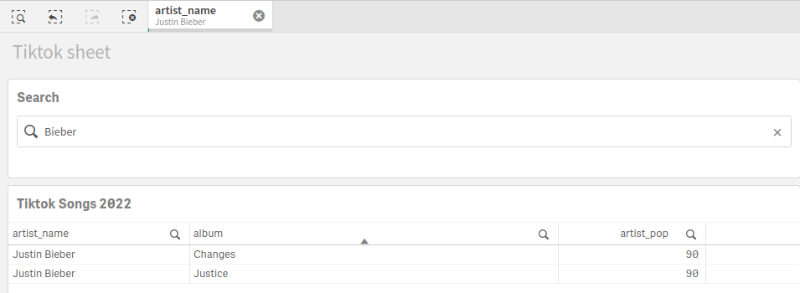

# dim-input
A Qlik Sense extension that provided a basic input to search in dimensions with wildcards

# Choose your dimensions

# Research your keywords

# Original authors
[github.com/dom-astro](https://github.com/dom-astro)

# License
Released under the [MIT License](LICENSE).
